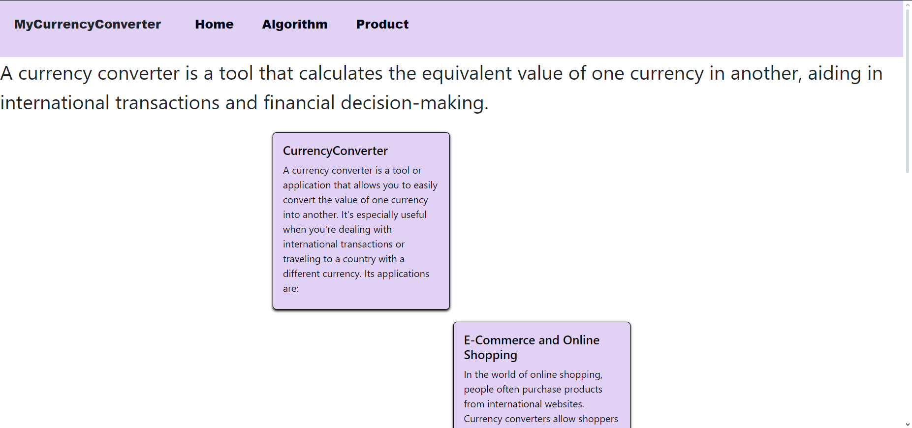
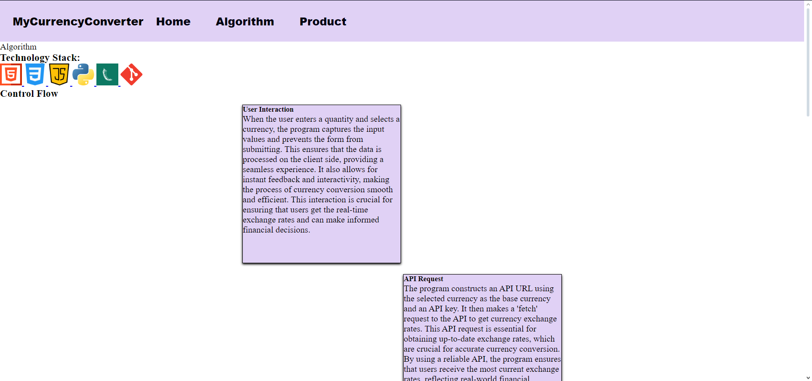
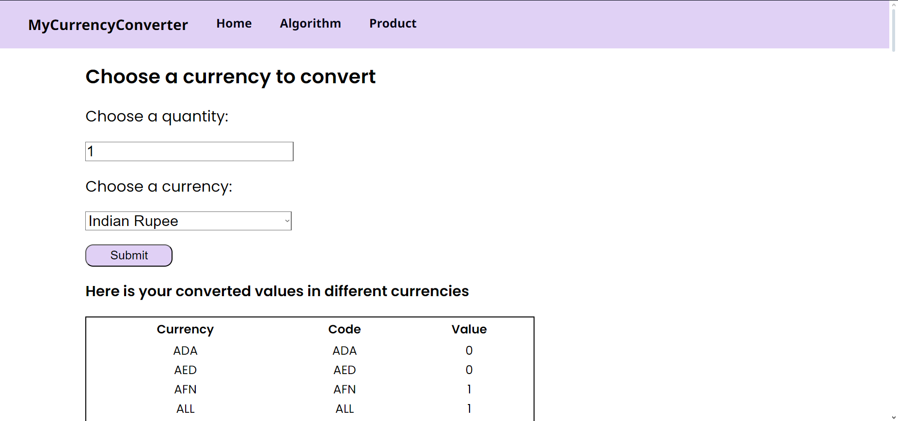
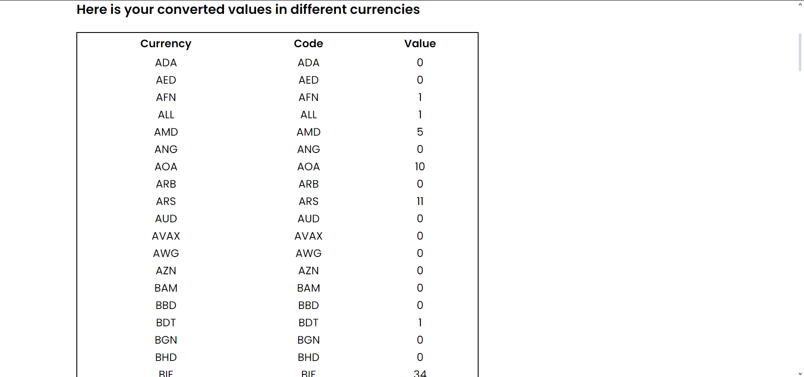

# MyCurrencyConverter

MyCurrencyConverter is a currency conversion tool built using Flask, HTML, CSS, and JavaScript. It allows users to convert currencies based on real-time exchange rates.

## Features

- Convert currency values between different currencies.
- Real-time exchange rates fetched from the currencyapi.com API.
- Responsive design for seamless use on both desktop and mobile devices.

## Screenshots

## home page


## algorithm page


## product images



## Installation

1. Clone the repository:

    ```bash
    git clone https://github.com/amith0206/MyCurrencyConverter.git
    ```

2. Install dependencies:

    ```bash
    pip install -r requirements.txt
    ```

3. Run the Flask application:

    ```bash
    python app.py
    ```

4. Open your web browser and navigate to [http://127.0.0.1:5000](http://127.0.0.1:5000).

## Usage

- Choose a quantity and select the currency you want to convert from.
- Click the "Submit" button to view the converted values in different currencies.

## Contributing

Pull requests are welcome. For major changes, please open an issue first to discuss what you would like to change.

